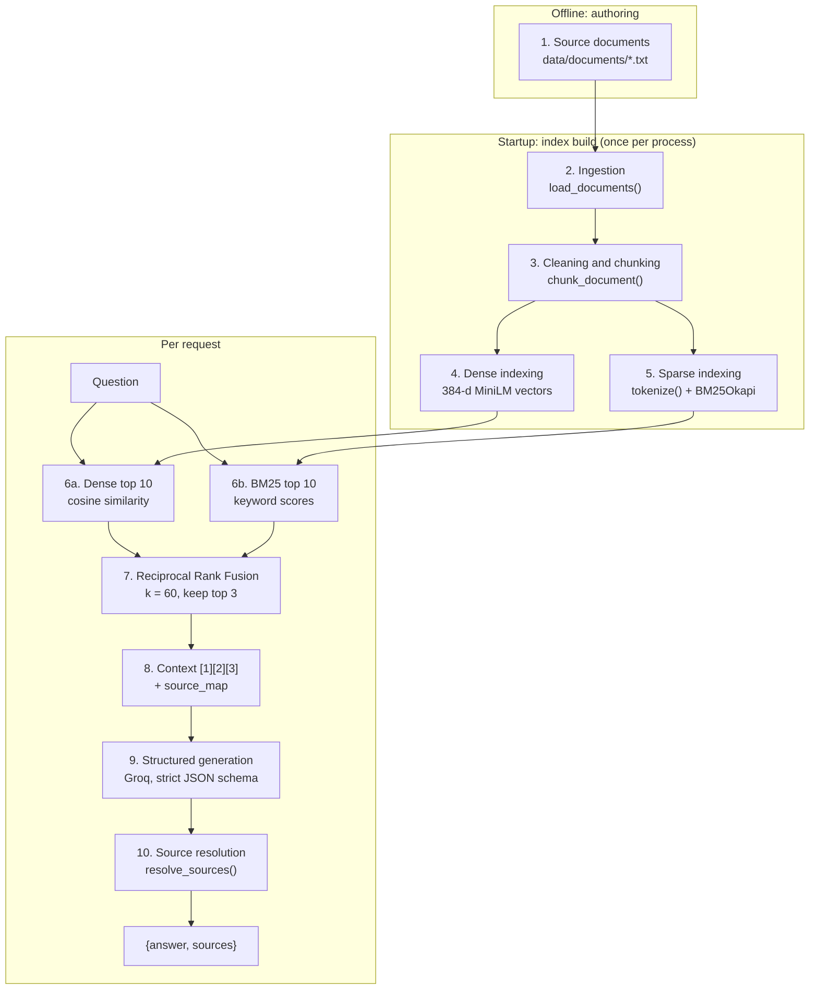

# Ask Bach

**A production-deployed retrieval-augmented generation (RAG) service that answers questions about Bach Nguyen's experience, research, education and projects, with citations resolved by application code rather than invented by the model.**


## Why I built this

Ask Bach is a production-oriented RAG system built to explore the **full lifecycle of an AI application**: document ingestion, dense and lexical retrieval, hybrid ranking, grounded generation, structured citations, retrieval evaluation, API design, containerization, cloud deployment, secret management and front-end integration. It powers the "Ask Bach" feature of my portfolio site, but the real goal was to build every layer myself and **measure** each decision instead of guessing.

### What it does

A visitor asks a question; the service retrieves the most relevant passages from a curated knowledge base, has an LLM answer **only from those passages**, and returns the answer with **sources validated in Python**:

```http
POST /ask
Content-Type: application/json

{"question": "What did Bach do at CMHA?"}
```

```json
{
  "answer": "Bach was an IT intern at the Canadian Mental Health Association (CMHA) Durham, where he built Power Apps and Power Automate booking workflows that eliminated double-bookings ...",
  "sources": [
    {"source": "cmha.txt", "chunk_id": 3},
    {"source": "cmha.txt", "chunk_id": 2}
  ]
}
```

When the knowledge base does not contain the answer, it declines instead of guessing, and cites nothing:

```json
{"answer": "I don't have enough information to answer.", "sources": []}
```

### Highlights

- **Hybrid retrieval:** MiniLM dense search + BM25, merged with Reciprocal Rank Fusion.
- **Citations the model cannot fabricate:** the LLM returns integer evidence IDs only; Python maps them to real documents.
- **Strict structured output:** JSON-schema-constrained generation, so there is no parsing of free text.
- **Measured, not tuned by feel:** each retrieval change was tested one variable at a time against a frozen benchmark, and the [limitations of that benchmark](#interpreting-the-numbers) are stated explicitly.
- **Deployed:** Docker image in Azure Container Registry, running on Azure Container Apps, pulled with a managed identity, and called over HTTPS from a GitHub Pages / Astro front end.

> **Status (2026-10-06):** live in production and called by the portfolio site. There is no automated test suite yet; see [Roadmap](#roadmap).

---

## Repository structure

```
.
├── app/                         # Python project root (run commands from here)
│   ├── data/
│   │   └── documents/           # Knowledge base: 6 plain-text profile documents
│   ├── src/
│   │   ├── api.py               # FastAPI app: GET /, POST /ask, CORS, validation
│   │   ├── rag.py               # ★ Pipeline orchestrator: answer_question()
│   │   ├── generate.py          # Groq client, structured generation
│   │   ├── hybrid_retriever.py  # Reciprocal Rank Fusion of dense + BM25
│   │   ├── bm25_retriever.py    # Tokenizer, BM25 index and retriever
│   │   ├── embed_documents.py   # MiniLM dense index and retriever
│   │   ├── load_documents.py    # Load, clean and chunk documents
│   │   ├── similarity.py        # Cosine similarity
│   │   ├── metrics.py           # reciprocal_rank() for MRR@k
│   │   ├── eval_retrieval.py    # Retrieval evaluation (Recall, Precision, MRR @3)
│   │   └── run_eval.py          # End-to-end answer evaluation (legacy pipeline)
│   └── requirements.txt         # Pinned dependencies
├── eval/                        # Canonical evaluation outputs (JSON)
├── Dockerfile                   # Production image (python:3.12-slim + uvicorn)
├── LICENSE                      # MIT, covers the code
├── NOTICE                       # Rights reserved on the personal documents
└── README.md
```

**`app/` is the Python project root.** Modules import each other as `src.*`, so commands run from `app/` as modules, e.g. `python -m src.rag` or `uvicorn src.api:app`. This mirrors the container, where `app/` becomes `/app`.

**Where to start reading:** `app/src/rag.py`. `answer_question()` calls every pipeline stage in order, and `app/src/api.py` is a thin HTTP wrapper around it.

---

## Table of contents

- [System architecture](#system-architecture)
- [Request lifecycle: one question, end to end](#request-lifecycle-one-question-end-to-end)
- [Data pipeline](#data-pipeline)
- [Knowledge base](#knowledge-base)
- [Getting started](#getting-started)
- [Configuration reference](#configuration-reference)
- [HTTP API reference](#http-api-reference)
- [Python API reference](#python-api-reference)
- [Running with Docker](#running-with-docker)
- [Azure deployment](#azure-deployment)
- [Deployment lessons learned](#deployment-lessons-learned)
- [Evaluation](#evaluation)
- [Experiment log](#experiment-log)
- [Design decisions](#design-decisions)
- [Security and privacy](#security-and-privacy)
- [Performance characteristics](#performance-characteristics)
- [Known limitations](#known-limitations)
- [Roadmap](#roadmap)
- [Troubleshooting](#troubleshooting)
- [License](#license)
- [Acknowledgements](#acknowledgements)

---

## System architecture

```
GitHub Pages / Astro front end  (bachnguyennn.github.io)
        │  HTTPS  POST /ask
        ▼
Azure Container Apps            (Canada Central)
  - Consumption workload profile
  - External ingress → target port 8000
  - 1 vCPU / 2 GiB
  - Image pulled from Azure Container Registry via user-assigned managed identity
  - GROQ_API_KEY injected from a Container Apps secret (secretref)
        │
        ▼
Docker container                (python:3.12-slim, linux/amd64)
        │
        ▼
FastAPI + Uvicorn               (src/api.py)
        │
        ▼
Hybrid RAG                      (src/rag.py → dense + BM25 → RRF → context)
        │  prompt + JSON schema
        ▼
Groq API                        (openai/gpt-oss-120b, strict structured output)
```

**Responsibilities by layer:**

| Layer | Component | Decides |
|---|---|---|
| Transport | `src/api.py` (FastAPI) | Whether the request is valid and allowed (schema, length, CORS). |
| Retrieval | `src/hybrid_retriever.py` | Which 3 chunks the model gets to see. |
| Generation | `src/generate.py` (Groq LLM) | What to say, and which evidence IDs it claims to have used. |
| Validation | `src/rag.py` (`resolve_sources`) | Whether those IDs are valid, and which real document chunk each one refers to. |
| Presentation | Portfolio front end | How the answer and sources are displayed. |

---

## Request lifecycle: one question, end to end

The trace below follows a real query. The top-3 chunks are the actual hybrid results from the [evaluation run](#evaluation).

```
"What did Bach do at CMHA?"
        │
        ▼
MiniLM query embedding (384-d)            BM25 tokens → ['bach', 'at', 'cmha']
        │                                         │
        ▼                                         ▼
Dense top 10 (cosine)                     BM25 top 10
  1. cmha.txt      c3  0.4842               1. cmha.txt  c3  4.2072
  2. education.txt c3  0.4838               2. cmha.txt  c2  3.9706
  3. about.txt     c0  0.4764               3. cmha.txt  c0  3.6888
  ...                                       ...
        └──────────────────┬──────────────────┘
                           ▼
Reciprocal Rank Fusion (k = 60) → top 3
  1. cmha.txt c3  0.0328
  2. cmha.txt c2  0.0313
  3. about.txt c0 0.0306
                           │
                           ▼
Context sent to the LLM           source_map kept in Python (never sent)
  [1] <cmha c3 text>                1 → cmha.txt  chunk 3
  [2] <cmha c2 text>                2 → cmha.txt  chunk 2
  [3] <about c0 text>               3 → about.txt chunk 0
                           │
                           ▼
Groq structured output (strict JSON schema)
  {"answer": "...", "used_context": [1, 2]}
                           │
                           ▼
resolve_sources([1, 2], source_map)
  → cmha.txt chunk 3, cmha.txt chunk 2
                           │
                           ▼
API response
  {"answer": "...", "sources": [{"source": "cmha.txt", "chunk_id": 3},
                                {"source": "cmha.txt", "chunk_id": 2}]}
```

Two observations from this trace:

- **Fusion at work.** Dense search alone ranked an unrelated education chunk second. BM25 ranked three CMHA chunks at the top, and RRF combined the two lists into a context that is mostly CMHA evidence.
- **The model chose its evidence.** It cited [1] and [2] and skipped the weaker general-profile chunk [3].

> **Core design decision:** The model returns only integer evidence IDs. Source filenames and chunk IDs are resolved by application code after generation. This prevents the model from fabricating source metadata, although it does not by itself guarantee claim-level groundedness.

The last sentence matters. In testing, the model wrote that Bach *"saved more than five staff hours per week **for over 100 staff**"*. Both facts appear in the cited CMHA chunk, but the source never states that relationship between them. The citation was valid; the claim was not fully supported. See [Known limitations](#known-limitations).

---

## Data pipeline

This section documents every step data goes through, from a hand-written text file to the JSON returned to the browser.



### Pipeline lifecycle

| Phase | When it runs | What happens | Cost |
|---|---|---|---|
| **Authoring** | Manually, when profile information changes | Edit or add `.txt` files in `app/data/documents/`. | None at runtime. |
| **Image build** | `docker buildx build` | Documents and code are copied into the image. Indexes are **not** precomputed. | One-off. |
| **Startup** | When `src.api` is first imported (container start or `uvicorn` launch) | Documents are loaded and chunked, the embedding model is loaded (downloaded on first boot), all 33 chunks are embedded, and the BM25 index is built. | Several seconds; about 90 MB model download on a fresh container. This is the main cold-start cost. |
| **Request** | Every `POST /ask` | Retrieval, fusion, context assembly, one LLM call, source resolution. | Retrieval takes milliseconds; the Groq call dominates (about 0.4–1.3 s observed). |

Indexes live in process memory only. Nothing is persisted between restarts, and there is no vector database. At 33 chunks this is the simplest correct design; see [Design decisions](#design-decisions).

### Stage 1: Source documents

**Location:** `app/data/documents/`. Six hand-written plain-text files. They are the **only** source of truth the model can draw on. See [Knowledge base](#knowledge-base).

### Stage 2: Ingestion

**Function:** `load_documents(docs_dir=DOCS_DIR)` in `src/load_documents.py`

- Reads every `*.txt` file in `DOCS_DIR`, **sorted by filename**, so ordering and chunk numbering are deterministic.
- Decodes as UTF-8, strips surrounding whitespace, and skips empty files.
- `DOCS_DIR` is resolved relative to the source file, so it works from any working directory: `app/data/documents` locally and `/app/data/documents` in the container.

**Output:** `[{"source": "about.txt", "text": "<full file text>"}, ...]`

### Stage 3: Cleaning and chunking

**Function:** `chunk_document(doc, max_chars=1200)` in `src/load_documents.py`

1. **Divider removal:** lines made only of `=` characters are dropped. Blank lines are kept, because they mark paragraph boundaries.
2. **Title extraction:** the first remaining line is the document title, e.g. `IT INTERN — CANADIAN MENTAL HEALTH ASSOCIATION (CMHA DURHAM)`.
3. **Paragraph split:** the rest is split on blank lines into paragraphs.
4. **Greedy packing:** paragraphs are appended to the current chunk until the next one would push the body past 1,200 characters; then a new chunk starts.
5. **Title prefixing:** the document title is prepended to **every** chunk, so a chunk from the middle of `cmha.txt` still states what it is about. This helps both the embedding model and BM25.
6. **Identity assignment:** `chunk_id` is the chunk's 0-based position within its document.

**Edge cases:** a single paragraph longer than `max_chars` becomes its own oversized chunk and is never split. `max_chars` limits the body *before* the title is added, so chunks can exceed 1,200 characters (the current maximum is 1,268).

**Output:**

```python
{"source": "cmha.txt", "chunk_id": 3, "text": "IT INTERN — CANADIAN MENTAL HEALTH ...\n\n- Where did Bach intern? ..."}
```

`(source, chunk_id)` is the chunk's **stable identity** across fusion, evaluation labels, the source map and the API response.

> ⚠️ **Chunk IDs are derived, not stored.** Editing a document or changing `max_chars` can renumber chunks and silently invalidate the relevance labels in `src/eval_retrieval.py`. Re-check the labels after any such change.

### Stage 4: Dense indexing

**Module:** `src/embed_documents.py` (the name is historical; this is the dense retriever)

- Model: [`sentence-transformers/all-MiniLM-L6-v2`](https://huggingface.co/sentence-transformers/all-MiniLM-L6-v2), loaded once at import.
- Each chunk's full text (title included) is encoded into a **384-dimensional** vector; an assertion checks that there is one embedding per chunk.
- Vectors are held in memory as a NumPy array and searched by brute force, which is exact and fast at this size.

### Stage 5: Sparse (BM25) indexing

**Module:** `src/bm25_retriever.py`, using `rank_bm25.BM25Okapi` with default parameters (`k1=1.5`, `b=0.75`). Chunks and queries share one tokenizer:

```python
tokenize("What programming languages does Bach know?")
# → ['programming', 'languages', 'bach', 'know']
```

1. Lowercase, then `re.findall(r"\w+", ...)`, which drops punctuation (`"languages:"` → `languages`, `C++` → `c`, `Bach's` → `bach`, `s`).
2. Remove a 25-word stopword list (`STOPWORDS`): articles, forms of *be/do/have*, question words and common prepositions.
3. **No stemming**, so `researching` does not match `research`.
4. **`bach` is deliberately kept.** Removing it was tested; see the [Experiment log](#experiment-log).

### Stage 6: Candidate retrieval

Both retrievers return the same shape, `[(chunk, score), ...]` sorted by descending score, which keeps fusion simple.

| Retriever | Function | Score | Depth |
|---|---|---|---|
| Dense | `retrieve_top_k_documents(query, embeddings, chunks, k)` | Cosine similarity (`src/similarity.py`) | `candidate_k = 10` |
| BM25 | `retrieve_bm25(query, chunks, bm25, k)` | BM25 Okapi score | `candidate_k = 10` |

**Why retrieve 10 when only 3 are used?** In testing, correct evidence often sat at rank 4 or 5 in one retriever. Fusing only each retriever's top 3 would discard it before fusion could promote it. Candidate depth does not have to equal context size.

### Stage 7: Reciprocal Rank Fusion

**Function:** `reciprocal_rank_fusion(dense_results, bm25_results, rrf_k=60)` in `src/hybrid_retriever.py`

$$\text{RRF}(c) = \frac{1}{k + \text{rank}_\text{dense}(c)} + \frac{1}{k + \text{rank}_\text{BM25}(c)}, \qquad k = 60$$

- A chunk missing from one list gets no contribution from it.
- Chunks are matched across lists by `(source, chunk_id)`, never by text.
- RRF uses **ranks only**, so the dense and BM25 scores, which are on completely different scales, never need to be normalised.
- `retrieve_hybrid(query, candidate_k=10, final_k=3, rrf_k=60)` returns the top `final_k`; `final_k=None` returns the full fused ranking (used by the evaluation).

**Known property:** RRF ignores score magnitude, so a confident ranking and a near-tie contribute identically. Fusion also cannot fix cases where both retrievers rank the same wrong chunks highly.

### Stage 8: Context assembly and source map

**Function:** `build_context_and_source_map(results)` in `src/rag.py`

This produces two parallel structures from the top 3 chunks. The model sees evidence IDs and chunk text in the context string. Python keeps the source map, `{1: {"source": "cmha.txt", "chunk_id": 3}, ...}`, which never enters the prompt. See the [request lifecycle](#request-lifecycle-one-question-end-to-end) for a concrete example.

The prompt (`build_structured_prompt`) instructs the model to answer only from the context, to say when it does not have enough information, to list the evidence IDs it actually used in `used_context`, and not to put citation markers in the answer text.

### Stage 9: Structured generation

**Function:** `generate_structured(prompt)` in `src/generate.py`

- **Provider:** [Groq](https://console.groq.com). **Model:** `openai/gpt-oss-120b` (constant `MODEL`).
- **Authentication:** `GROQ_API_KEY` from the process environment. It is never in code or in the image.
- **Output contract:** Groq structured outputs in **strict** JSON-schema mode:

```python
ANSWER_SCHEMA = {
    "type": "object",
    "properties": {
        "answer": {"type": "string"},
        "used_context": {"type": "array", "items": {"type": "integer"}},
    },
    "required": ["answer", "used_context"],
    "additionalProperties": False,
}
```

> **Schema validation checks structure, not truth.** `{"answer": "Bach worked at Google.", "used_context": [999]}` is schema-valid. That is why Stage 10 exists.

### Stage 10: Source resolution

**Function:** `resolve_sources(used_context, source_map)` in `src/rag.py`

| Model returns | Result | Rationale |
|---|---|---|
| `[1, 3]` | sources for 1 and 3, in that order | Normal case. |
| `[1, 999]` | source for 1 only | Invalid IDs are ignored. They are tolerated for now so model behaviour can be observed; this may become a hard failure. |
| `[1, 1]` | source for 1 once | Duplicates are removed. |
| `[]` | `[]` | No evidence used, e.g. a refusal. |

**Guaranteed:** every returned source is a chunk that was actually retrieved and shown to the model for this question.
**Not guaranteed:** that the chunk supports every sentence of the answer.

### Data shapes at each stage

| Stage | Produced by | Shape |
|---|---|---|
| Document | `load_documents` | `{"source": str, "text": str}` |
| Chunk | `chunk_document` | `{"source": str, "chunk_id": int, "text": str}` |
| Dense index | `embed_documents` (module level) | `np.ndarray`, shape `(33, 384)` |
| BM25 index | `bm25_retriever` (module level) | `BM25Okapi` over `list[list[str]]` |
| Candidates | `retrieve_top_k_documents`, `retrieve_bm25` | `list[tuple[chunk, float]]`, length 10 |
| Fused results | `retrieve_hybrid` | `list[tuple[chunk, float]]`, length 3 |
| Context | `build_context_and_source_map` | `str` with `[1]`, `[2]`, `[3]` blocks separated by `---` |
| Source map | `build_context_and_source_map` | `dict[int, {"source": str, "chunk_id": int}]` |
| Model output | `generate_structured` | `{"answer": str, "used_context": list[int]}` |
| API response | `answer_question` | `{"answer": str, "sources": list[{"source": str, "chunk_id": int}]}` |

---

## Knowledge base

### Documents

| File | Covers | Chunks |
|---|---|---|
| `about.txt` | Profile, short bio, experience summary, technical skills, working style, what Bach is looking for, contact links | 5 |
| `azure.txt` | Statistics Without Borders Azure pipeline work, Hack Hive Azure challenge, cloud and data-engineering skills | 3 |
| `cmha.txt` | IT internship at CMHA Durham: overview, data management and reporting, IT support, lessons learned | 4 |
| `education.txt` | Degree, coursework, certifications, thesis summary, TA role, campus leadership | 4 |
| `projects.txt` | Personal and academic ML, data and software projects | 10 |
| `research.txt` | Undergraduate thesis on continual learning for vision transformers, explained in plain language | 7 |
| **Total** | **≈ 32.5 KB of text** | **33** |

### Authoring conventions

The chunker depends on these rules:

1. **The first line is the document title.** It is prepended to every chunk, so make it descriptive.
2. **Separate paragraphs with one blank line.** Keep each paragraph under about 1,000 characters so it can share a chunk.
3. **`=====` divider lines are allowed**; they are stripped automatically.
4. **Write in the third person and name the subject** ("Bach built ..."), so chunks read correctly out of context.
5. **End sections with a `QUICK FACTS (FOR COMMON QUESTIONS)` block** of short Q&A lines. These improve retrieval for direct questions, but they also act as "hubs" that rank for many queries, so keep them specific.
6. **Only write facts that are fine to repeat publicly.** Anything here can appear in an answer.

### Adding or updating a document

1. Edit or add a `.txt` file in `app/data/documents/`.
2. From `app/`, check chunking with `python -m src.load_documents` and spot-check retrieval with `python -m src.hybrid_retriever`.
3. If chunk IDs moved, update the labels in `src/eval_retrieval.py`, re-run `python -m src.eval_retrieval`, and compare against the [published results](#retrieval-evaluation).
4. Rebuild and redeploy the image ([Updating the deployment](#updating-the-deployment)). Indexes are rebuilt at startup, so there is no separate indexing job.

---

## Getting started

### Prerequisites

| Requirement | Notes |
|---|---|
| Python **3.12** | Matches the Docker base image. |
| A Groq API key | Free at [console.groq.com/keys](https://console.groq.com/keys). |
| About 2 GB of disk | Mostly PyTorch. The embedding model (about 90 MB) downloads from Hugging Face on first run. |
| Docker with Buildx *(optional)* | Only needed to build or deploy the container. |

### Install

```bash
git clone <repository-url> ask-bach
cd ask-bach

python3.12 -m venv .venv
source .venv/bin/activate          # Windows: .venv\Scripts\activate
pip install -r app/requirements.txt
```

### Configure

The application reads `GROQ_API_KEY` from the **process environment**. For local development only, `src/generate.py` also loads a `.env` file from the **repository root** if one exists. The file is git-ignored, and real environment variables always take precedence over it.

```bash
echo "GROQ_API_KEY=<your-groq-api-key>" > .env
```

In Docker and Azure, no `.env` file is involved; the key is supplied by the runtime.

### Run the API locally

```bash
cd app
uvicorn src.api:app --reload --port 8000
```

Startup takes a few seconds while the indexes are built; `Loaded 6 documents ...` prints twice, once per index. Then:

```bash
curl -s http://localhost:8000/
# {"status":"Ask Bach API is running"}

curl -s -X POST http://localhost:8000/ask \
     -H "Content-Type: application/json" \
     -d '{"question": "What Azure experience does Bach have?"}'
```

Interactive API docs: <http://localhost:8000/docs> (Swagger UI) and <http://localhost:8000/redoc>.

### Run the modules as scripts

Every module with a `__main__` block doubles as a runnable demo. Run them from `app/`:

| Command | What it shows | Calls the LLM? |
|---|---|---|
| `python -m src.load_documents` | Number of chunks created | No |
| `python -m src.bm25_retriever` | BM25 top 10 for two test questions | No |
| `python -m src.hybrid_retriever` | Dense vs. BM25 vs. hybrid top 3, side by side | No |
| `python -m src.eval_retrieval` | Full retrieval evaluation; writes `eval/retrieval_results.json` | No |
| `python -m src.rag` | `resolve_sources` self-checks, then two verbose end-to-end answers | Yes (2 calls) |
| `python -m src.run_eval` | 8-question end-to-end evaluation; writes `eval/results.json` | Yes (8 calls) |

---

## Configuration reference

### Environment variables

| Variable | Required | Purpose |
|---|---|---|
| `GROQ_API_KEY` | **Yes** | Authenticates calls to the Groq API. In Azure it comes from the `groq-api-key` Container Apps secret. |
| `HF_TOKEN` | No | Hugging Face token; only needed if model downloads are rate-limited. |

### Tunable parameters

These are code constants. Changing retrieval parameters invalidates comparisons with the published evaluation.

| Parameter | Value | Location | Effect |
|---|---|---|---|
| `max_chars` | `1200` | `load_documents.py` | Maximum chunk body size before the title is prepended. |
| Embedding model | `all-MiniLM-L6-v2` | `embed_documents.py` | Dense representation (384-d). |
| `STOPWORDS` | 25 words | `bm25_retriever.py` | Tokens dropped before BM25 scoring. |
| `candidate_k` | `10` | `answer_question`, `retrieve_hybrid` | Candidates per retriever before fusion. |
| `rrf_k` | `60` | `retrieve_hybrid` | RRF smoothing constant (the standard value from the original paper). |
| `final_k` | `3` | `answer_question`, `retrieve_hybrid` | Chunks sent to the LLM. |
| `MODEL` | `openai/gpt-oss-120b` | `generate.py` | Groq model ID. |
| CORS origins | see [CORS](#cors) | `api.py` | Browser origins allowed to call the API. |
| Question length | 1–500 chars | `api.py` | Request validation bounds. |

---

## HTTP API reference

### `GET /`

Liveness check. The process only starts serving after the indexes are built.

```json
{"status": "Ask Bach API is running"}
```

### `POST /ask`

**Request body** (`application/json`)

| Field | Type | Constraints |
|---|---|---|
| `question` | string | Required. Whitespace is stripped **before** validation; the result must be 1–500 characters. |

**Response `200 OK`**

| Field | Type | Description |
|---|---|---|
| `answer` | string | The answer, with no inline citation markers. A refusal is a normal answer, not an error. |
| `sources` | array | Chunks the model reported using, validated against what was retrieved. Empty for refusals. |
| `sources[].source` | string | Document filename, e.g. `"cmha.txt"`. |
| `sources[].chunk_id` | integer | 0-based chunk index within that document. |

**Status codes**

| Code | When |
|---|---|
| `200` | Success, including refusals. |
| `422` | Missing `question`, wrong type, empty or whitespace-only, or over 500 characters. FastAPI's standard `{"detail": [...]}` body. |
| `500` | Unhandled upstream error, e.g. invalid Groq key, retired model, rate limit or network failure. |

**Example: front-end call**

```js
const res = await fetch(`${API_URL}/ask`, {
  method: "POST",
  headers: { "Content-Type": "application/json" },
  body: JSON.stringify({ question }),
});
if (!res.ok) throw new Error(`Ask Bach failed: ${res.status}`);
const { answer, sources } = await res.json();
```

**Example: validation error** for `{"question": "   "}`:

```json
{
  "detail": [{
    "type": "string_too_short",
    "loc": ["body", "question"],
    "msg": "String should have at least 1 character",
    "input": "   ",
    "ctx": {"min_length": 1}
  }]
}
```

### CORS

| Allowed origin | Purpose |
|---|---|
| `https://bachnguyennn.github.io` | Production portfolio (GitHub Pages) |
| `http://localhost:4321` | Local Astro dev server |

Only `POST` with the `Content-Type` header is allowed cross-origin, and credentials are disabled. CORS restricts browsers only; it is not authentication.

### OpenAPI

FastAPI serves `/openapi.json`, `/docs` (Swagger UI) and `/redoc`.

---

## Python API reference

```python
# run from app/
from src.rag import answer_question

response = answer_question("What Azure experience does Bach have?")
```

### `answer_question(question, candidate_k=10, final_k=3, verbose=False) -> dict`

| Parameter | Type | Default | Description |
|---|---|---|---|
| `question` | `str` | — | Natural-language question. |
| `candidate_k` | `int` | `10` | Candidates per retriever before fusion. |
| `final_k` | `int` | `3` | Chunks sent to the model as context. |
| `verbose` | `bool` | `False` | Print the raw model JSON, source map, resolved sources and final response. |

**Returns** `{"answer": str, "sources": [{"source": str, "chunk_id": int}, ...]}`.
**Side effects:** one Groq API call. Importing `src.rag` triggers the startup index build.
**Raises:** `groq` SDK exceptions on authentication, model or network errors.

---

## Running with Docker

| Dockerfile step | Detail |
|---|---|
| Base image | `python:3.12-slim` |
| Dependencies | `requirements.txt` copied and installed first, so the layer is cached when only code changes |
| Application | `app/src/` → `/app/src/`, `app/data/` → `/app/data/` |
| Port / command | `8000`, `python -m uvicorn src.api:app --host 0.0.0.0 --port 8000` |

The image contains **no secrets**; `.env` is never copied.

```bash
# Build for the same platform Azure runs (required on Apple Silicon)
docker buildx build --platform linux/amd64 -t ask-bach-api .

# Run locally
docker run --rm -p 8000:8000 --env-file .env ask-bach-api
```

---

## Azure deployment

### Production topology

| Component | Configuration |
|---|---|
| Front end | Astro site on GitHub Pages, calling the API over HTTPS |
| Compute | **Azure Container Apps**, `Consumption` workload profile, **Canada Central** |
| Ingress | External, HTTPS, target port `8000` |
| Resources | **1 vCPU / 2 GiB** per replica |
| Scaling | Default scale rule (min replicas 0), so the app scales to zero when idle |
| Image registry | **Azure Container Registry** (Basic), versioned tags (e.g. `ask-bach-api:v2`) |
| Registry auth | **User-assigned managed identity** with the `AcrPull` role; no registry passwords in the app |
| LLM credential | `groq-api-key` **Container Apps secret**, exposed to the container as `GROQ_API_KEY` via `secretref` |

### Deploying from scratch

The commands below reproduce the production setup. Resource names match production except the registry name, which must be globally unique.

```bash
RG=ask-bach-rg
LOCATION=canadacentral
ACR=<your-registry-name>
IDENTITY=ask-bach-identity
ENV=ask-bach-api-env
APP=ask-bach-api
TAG=v1

# 1. Resource group, registry and managed identity
az group create -n $RG -l $LOCATION
az acr create -g $RG -n $ACR --sku Basic
az identity create -g $RG -n $IDENTITY

IDENTITY_ID=$(az identity show -g $RG -n $IDENTITY --query id -o tsv)
PRINCIPAL_ID=$(az identity show -g $RG -n $IDENTITY --query principalId -o tsv)
ACR_ID=$(az acr show -n $ACR --query id -o tsv)
az role assignment create --assignee $PRINCIPAL_ID --role AcrPull --scope $ACR_ID

# 2. Build locally for linux/amd64 and push
az acr login -n $ACR
docker buildx build --platform linux/amd64 -t $ACR.azurecr.io/$APP:$TAG --push .

# 3. Container Apps environment and app
az containerapp env create -g $RG -n $ENV -l $LOCATION

read -rs GROQ_KEY   # paste the key; keeps it out of shell history
az containerapp create -g $RG -n $APP --environment $ENV \
  --workload-profile-name Consumption \
  --image $ACR.azurecr.io/$APP:$TAG \
  --user-assigned $IDENTITY_ID \
  --registry-server $ACR.azurecr.io --registry-identity $IDENTITY_ID \
  --target-port 8000 --ingress external \
  --cpu 1.0 --memory 2.0Gi \
  --secrets groq-api-key="$GROQ_KEY" \
  --env-vars GROQ_API_KEY=secretref:groq-api-key

# 4. Public URL for the front end
az containerapp show -g $RG -n $APP --query properties.configuration.ingress.fqdn -o tsv
```

### Updating the deployment

Use a new, immutable tag for every release so a previous revision can be restored:

```bash
TAG=v3
docker buildx build --platform linux/amd64 -t $ACR.azurecr.io/$APP:$TAG --push .
az containerapp update -g $RG -n $APP --image $ACR.azurecr.io/$APP:$TAG
```

**Rotating the Groq key:**

```bash
az containerapp secret set -g $RG -n $APP --secrets groq-api-key="$NEW_GROQ_KEY"
az containerapp revision restart -g $RG -n $APP \
  --revision $(az containerapp show -g $RG -n $APP --query properties.latestRevisionName -o tsv)
```

**Inspecting a failing revision:**

```bash
az containerapp revision list -g $RG -n $APP -o table
az containerapp logs show -g $RG -n $APP --tail 100
```

---

## Deployment lessons learned

Every one of these was hit in practice during the first deployment.

| # | Problem | Symptom | Resolution | Takeaway |
|---|---|---|---|---|
| 1 | **CPU architecture mismatch** | The image built on an Apple Silicon Mac was `linux/arm64`; Azure Container Apps runs `linux/amd64`, so the container could not start. | Rebuilt with `docker buildx build --platform linux/amd64`. | Always build for the target platform, not the laptop's. |
| 2 | **ACR Tasks unavailable** | The Azure for Students subscription blocks ACR Tasks, so cloud builds (`az acr build`, `az containerapp up --source`) failed. | Built the image locally and pushed it to ACR. | Subscription policy can rule out the "easy path". Local build + push is portable and works everywhere. |
| 3 | **Under-provisioned container** | At the initial 0.25 vCPU / 0.5 GiB, PyTorch + SentenceTransformers could not finish startup and the revision was marked unhealthy. | Increased to **1 vCPU / 2 GiB**. | Size containers for the model, not the web framework. Peak resident memory is about 600 MB after startup, plus import-time spikes. |
| 4 | **Secret handling** | The API needs `GROQ_API_KEY` at runtime. | Stored as a Container Apps **secret** and referenced with `secretref`; it is never baked into the image or committed. | Images are artifacts that get copied and cached; secrets belong in the runtime. |
| 5 | **Registry credentials** | The app needs to pull from a private registry. | A **user-assigned managed identity** with `AcrPull`, so there are no registry passwords in the app configuration. | Prefer identity-based access over shared keys. |
| 6 | **Cold start** | The embedding model is loaded and all 33 chunks are embedded at application startup (the model is also downloaded on a fresh container), and the app scales to zero when idle. | Accepted for now: the cost is a few seconds on the first request after idle. | Options: set `--min-replicas 1`, or bake the model into the image at build time. See [Roadmap](#roadmap). |

---

## Evaluation

There are two separate evaluations, because retrieval and generation fail in different ways. All outputs are written to the root **`eval/`** folder.

### Retrieval evaluation

**Script:** `app/src/eval_retrieval.py` (no LLM calls). **Output:** `eval/retrieval_results.json`.

It measures *question → retriever → top-3 evidence* for Dense, BM25 and Hybrid retrieval.

**Benchmark:** 10 queries, made up of 5 original questions and 5 paraphrases. Paraphrases share their original's relevance labels because they ask for the same information. Three unanswerable questions are defined for future refusal testing but are not scored here.

**Relevance rule** (fixed before any results were seen): *a chunk is relevant if, on its own, it supports a correct and specific answer: it names the role, the concrete work, or the fact. A passing mention or a bare skill keyword does not count.* Relevance is a **set** of chunks per question, so a valid summary source is not penalised.

| Metric | Question it answers | Definition |
|---|---|---|
| **Recall@3** | Did we retrieve at least one useful piece of evidence? | Share of queries with ≥ 1 relevant chunk in the top 3. |
| **Precision@3** | How much of the context is relevant? | Relevant chunks in the top 3 ÷ (3 × queries). |
| **MRR@3** | How early does the first relevant evidence appear? | Mean of 1/rank of the first relevant chunk in the top 3 (0 if none). |

**Frozen configuration:** Dense = `all-MiniLM-L6-v2` + cosine. BM25 = regex tokenizer + stopwords, no stemming, `bach` kept. Hybrid = `candidate_k=10`, `rrf_k=60`, `final_k=3`.

**Results** (2026-10-06; reproduced exactly by re-running the script):

| Metric | Dense | BM25 | Hybrid |
|---|---|---|---|
| Recall@3 | 8/10 | **10/10** | **10/10** |
| Precision@3 | 43% (13/30) | **73%** (22/30) | 70% (21/30) |
| MRR@3 *(post hoc)* | 0.700 | 0.833 | **0.950** |

### Interpreting the numbers

> **The evaluation set is intentionally small and should not be interpreted as statistically conclusive. MRR@3 was added after initial retrieval experiments and is therefore reported transparently as a post-hoc metric.**

More specifically:

- **Hybrid clearly beats dense. Hybrid vs. BM25 is not settled.** They tie on recall, BM25 is slightly ahead on precision, and hybrid's MRR lead comes from just two queries where BM25's top hit was a false keyword match.
- **100% recall hides a weakness.** For *"What is Bach researching?"*, every system passes only via a one-sentence summary in `about.txt`; no `research.txt` chunk reaches the top 3.
- **The paraphrases are easier than real user questions.** They were written by someone who knows the documents, and several reuse document wording, so they do not fully stress-test BM25.
- **Retrieval metrics say nothing about answer correctness.** Groundedness is not yet measured (see the lifecycle example above).

### End-to-end answer evaluation (legacy)

**Script:** `app/src/run_eval.py`. **Output:** `eval/results.json`. It runs 8 questions (5 answerable, 3 that should be refused) through the **earlier** dense-only, free-text pipeline.

| Measure | Result (2026-10-06, `openai/gpt-oss-120b`) |
|---|---|
| Answerable questions answered correctly | 4/5 (the miss was a retrieval failure: the evidence ranked 5th) |
| Unanswerable questions correctly refused | 3/3 |
| Latency per question | 0.4–1.3 s |

This script has not yet been migrated to the hybrid + structured pipeline.

---

## Experiment log

Each step changed **one variable** and was measured before moving on.

| # | Experiment | Finding |
|---|---|---|
| 1 | Dense top 3 on 8 questions | 4/5 answerable, 3/3 refusals. "Programming languages" failed: evidence ranked **#5**. |
| 2 | Dense top 10 | Correct evidence for both failing questions sat at **#5**. The same three general chunks topped *every* query. |
| 3 | Query wording (remove "Bach") | Languages: evidence moved **#5 → #1**; the name pulled queries toward general chunks. Research: no help; the query shares no topical words with the document. Two different failure causes. |
| 4 | BM25 with `.split()` | Evidence only #4: `"languages:"` ≠ `"languages"`, and Q&A chunks scored on `what`/`does`/`is`. |
| 5 | BM25 + regex tokenizer | Languages → **#1**, narrowly (7.45 vs. 6.93). |
| 6 | BM25 + stopwords | Languages lead widened to about 2× (7.08 vs. 3.60). Research got *worse*: with only `bach` left to match, the ranking became near-random. |
| 7 | Hybrid RRF | Languages fixed (#1) by a margin of 0.000024. Research unchanged: **fusion cannot fix failures both retrievers share**. |
| 8 | Frozen three-way eval + paraphrases | See [Retrieval evaluation](#retrieval-evaluation). |
| 9 | Structured generation with evidence IDs | Invented citations (`【1†L7-L9】`) disappeared; the Google question returned `used_context: []`. |
| 10 | Serving and deployment | FastAPI → Docker → Azure Container Apps; see [Deployment lessons learned](#deployment-lessons-learned). |

---

## Design decisions

**The model returns evidence IDs, never source metadata.** The model returns only integer evidence IDs. Source filenames and chunk IDs are resolved by application code after generation. This prevents the model from fabricating source metadata, although it does not by itself guarantee claim-level groundedness. Before this change, the model produced inconsistent and invented citations (`【2†source】`, `【1†L7-L9】`, line numbers that do not exist).

**Structured output instead of parsing prose.** Strict JSON-schema mode guarantees the response shape; validation of the *content* still happens in Python.

**Hybrid retrieval, with an open question.** Dense alone fails when the query is dominated by the subject's name; BM25 alone fails on coincidental keyword matches. RRF was never worse than BM25 on any query, but the evidence that it is *better* is still thin.

**Candidate depth ≠ context size.** Searching 10 deep but sending 3 chunks lets fusion rescue evidence ranked 4–5 without inflating the prompt.

**In-memory indexes, no vector database.** 33 chunks embed in seconds, and brute-force search is exact and instant. A vector store would add a service and a sync problem without improving quality. Revisit at thousands of chunks.

**Configuration from the environment.** The application reads `GROQ_API_KEY` from the process environment. A `.env` file is only a local-development convenience, loaded from one documented location.

**Evaluation frozen before measuring.** Tuning `k`, stopwords or `rrf_k` against 10 queries would overfit, and so would adding questions *because* a system fails or wins on them.

---

## Security and privacy

| Area | Posture |
|---|---|
| **Secrets** | `GROQ_API_KEY` lives in a Container Apps secret. `.env` is git-ignored and never copied into the image. The git history has been checked: `git grep -E 'gsk_[A-Za-z0-9]{20,}' $(git rev-list --all)` returns nothing. |
| **Registry access** | Pulls use a managed identity with `AcrPull`; there are no registry credentials in the app. |
| **Input validation** | Questions are stripped and limited to 1–500 characters, which bounds prompt size and cost. |
| **CORS** | Limited to the portfolio origin and the local dev server, `POST` only, no credentials. This does not authenticate non-browser clients. |
| **Prompt injection** | The model has no tools and sees only public documents, so the impact is limited to an off-topic or wrong answer. Citations cannot be forged, because they come from `source_map`. |
| **Data exposure** | Everything in `app/data/documents/` is treated as public. |
| **Rate limiting** | None at the API layer yet, so abuse could exhaust the Groq quota. See [Roadmap](#roadmap). |
| **Third parties** | Questions and retrieved context are sent to Groq for inference. |

---

## Performance characteristics

| Metric | Observed |
|---|---|
| Corpus | 6 documents, 33 chunks, about 32.5 KB |
| Retrieval latency | Milliseconds |
| End-to-end latency | 0.4–1.3 s per question, dominated by the Groq call |
| Peak memory after startup | About 600 MB (measured locally); production allocation is 2 GiB |
| Cold start | Several seconds (model load + 33 embeddings), longer on a fresh container that downloads the model |
| LLM calls | Exactly one per `/ask` |

---

## Known limitations

**Answer quality**

- **Groundedness is not checked.** Valid sources do not mean every sentence is supported (see the [lifecycle example](#request-lifecycle-one-question-end-to-end)).
- The documents never state Bach's pronouns, so the model infers them.
- Refusal wording varies between responses.

**Retrieval**

- Research questions do not retrieve `research.txt` in the top 3 (no topical overlap, no stemming).
- `QUICK FACTS` Q&A chunks act as hubs that rank for many queries.
- Section headings can land at the end of the previous chunk.

**Evaluation**

- A small benchmark (10 retrieval queries, 8 end-to-end) whose paraphrases share document vocabulary.
- `run_eval.py` still uses the legacy pipeline.
- Relevance labels are tied to current chunk IDs.

**Engineering**

- No automated tests, and no custom error handling (upstream failures surface as `500`).
- No API rate limiting or authentication.
- `load_chunks()` runs once per index, so documents are loaded twice at startup.
- The default PyTorch wheel pulls CUDA libraries on Linux, making the image several GB; a CPU-only wheel would shrink it substantially.

---

## Roadmap

1. **Hardening:** map Groq failures to `502`/`503` with a friendly message; add rate limiting, a readiness probe and structured logging of latency and sources.
2. **Testing and CI:** unit tests for `chunk_document`, `tokenize`, `reciprocal_rank_fusion` and `resolve_sources`; an API test with the LLM mocked; GitHub Actions to build and push the image on tag.
3. **Startup and image size:** CPU-only PyTorch, and bake the embedding model into the image.
4. **Evaluation:** grow to 50–100 questions across categories (direct, independently written paraphrases, multi-fact, vague, unanswerable, adversarial); add groundedness, citation-correctness, refusal-rate and latency metrics.
5. **Retrieval** (only once the larger eval set exists): stemming, cross-encoder re-ranking, query rewriting, heading-aware chunking.

---

## Troubleshooting

| Symptom | Cause and fix |
|---|---|
| `ModuleNotFoundError: No module named 'src'` | Run from `app/` as a module: `python -m src.rag`, not `python src/rag.py`. |
| `GroqError: The api_key client option must be set` | `GROQ_API_KEY` is not set. Export it, or put it in `.env` at the **repository root**, or pass `--env-file .env` to Docker. |
| `groq.AuthenticationError: 401 invalid_api_key` | The key is wrong or truncated. Create a new one at console.groq.com/keys (it is shown once). |
| `groq.NotFoundError: 404 model_not_found` | The model was retired. List models with `from src.generate import client; [m.id for m in client.models.list().data]` and update `MODEL`. |
| `500` from `/ask` | Upstream Groq error. Check `az containerapp logs show` (or local logs) for the traceback. |
| `422` from `/ask` | The body is missing `question`, it is blank, or it is over 500 characters. |
| CORS error in the browser | The page's origin is not in `allow_origins` in `src/api.py`. |
| Container will not start: `exec format error` | ARM image. Rebuild with `--platform linux/amd64`. |
| Revision unhealthy / restarting | Usually memory. Allocate 1 vCPU / 2 GiB. |
| First request after idle is slow | Cold start from scale-to-zero. Set `--min-replicas 1` to keep a replica warm. |
| Eval relevance looks wrong after editing a document | Chunk IDs shifted; re-check the labels in `src/eval_retrieval.py`. |

---

## License

Code in this repository is licensed under the [MIT License](LICENSE).

Content in `app/data/documents/` contains personal biographical, educational, employment, and project information and is **not** licensed for redistribution or reuse under the MIT License. See [NOTICE](NOTICE). If you fork this project, replace those documents with your own.

---

## Acknowledgements

- [Sentence-Transformers](https://www.sbert.net/) and `all-MiniLM-L6-v2`
- [rank_bm25](https://github.com/dorianbrown/rank_bm25)
- [Groq](https://groq.com/) for low-latency inference and structured outputs
- [FastAPI](https://fastapi.tiangolo.com/) and [Uvicorn](https://www.uvicorn.org/)
- Cormack, Clarke and Büttcher, *Reciprocal Rank Fusion outperforms Condorcet and individual Rank Learning Methods* (SIGIR 2009)
